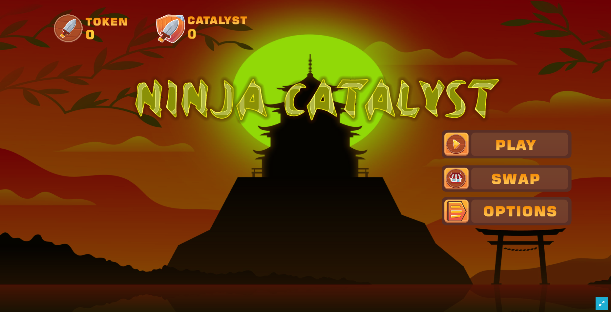
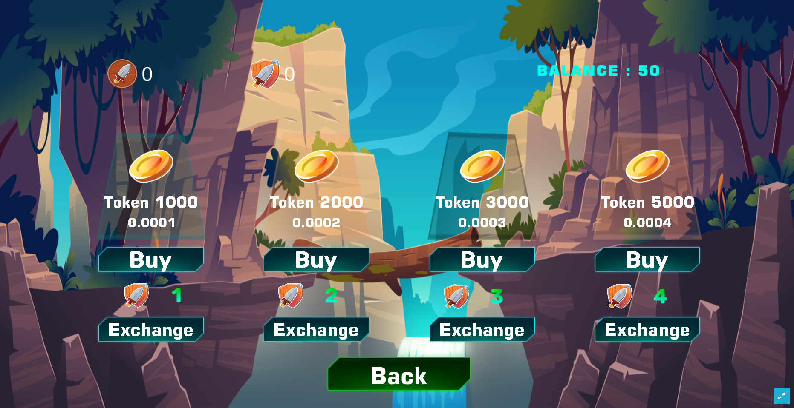
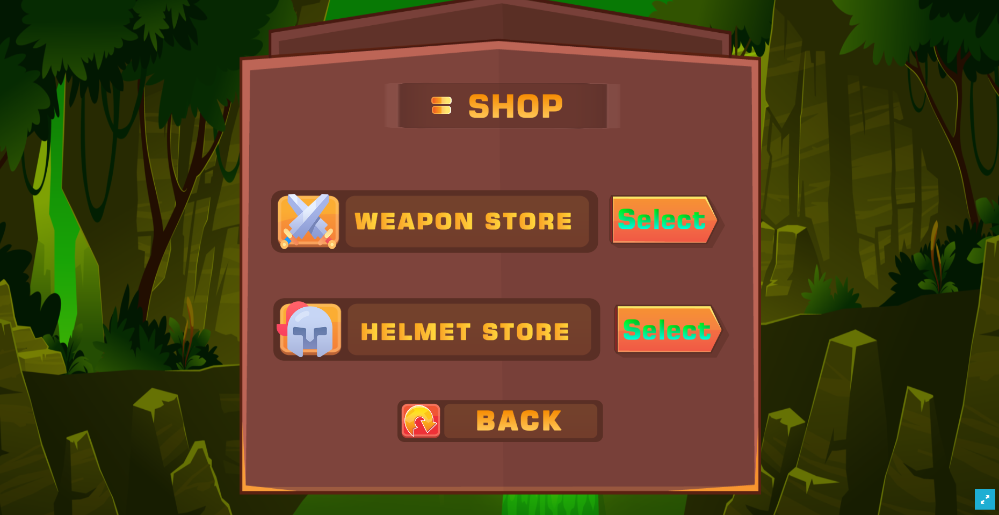
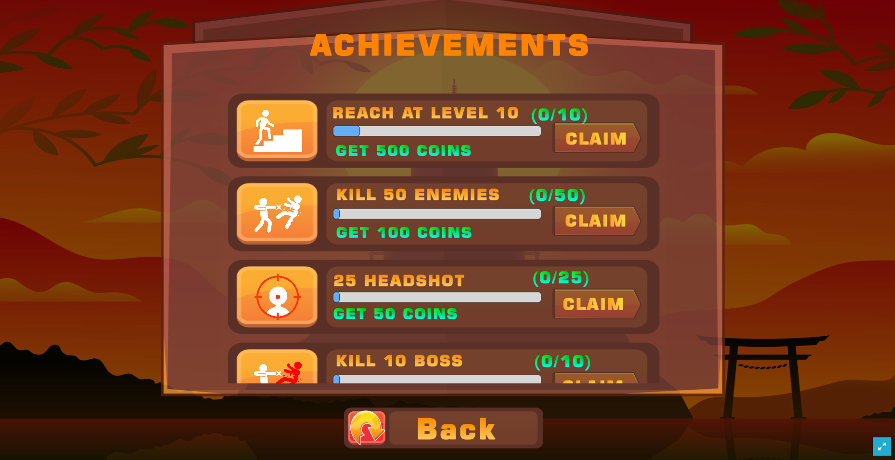
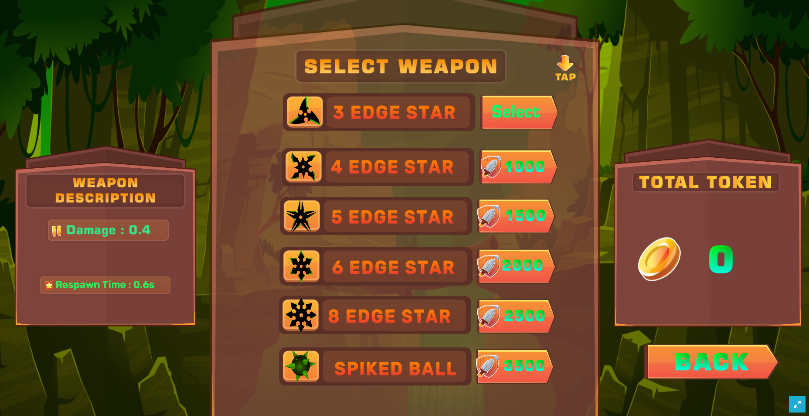

# NinjaCatalyst
Ninja catalyst Game is Play-To-Earn which combines 3 important components such as Web3,Unity and Mantle Chain for the whole Crypto Communities or NFT Enthusias who like to play Adventure Game.

## Problem
The  flow of each nft game causes 3 main problems
1. Always use social media to connected into the game
2. Items in the games are expensive
3. There is no incentive for every user who plays the game

## Problem we solve
1. A platform where gaming communities & service providers can build good membership and community due to great incentives to users
2. Easy interaction
3. Open source
4. All items in the game are very cheap and each user will get a big incentive using the Catalyst Token

## Why we use Mantle Chain?
1. Wide Adoption
2. Fast
3. Focuses on developing a for-benefit blockchain ecosystem
4. Sustainability driven blockchain with reputation-based mechanisms
5. Combines roll-up technology with a decentralized data availability layer and more
6. Fully Ethereum Virtual Machine (EVM)

## Web App Demo
### 1. Mantle Testnet : [https://web.catalystt.net/](https://web.catalystt.net/)

## Features
* Adventure, action RPG game
* Multiple in-game items to unlock
* Decentralized finance system (DeFi) with in-app items
* Earn reward as ERC-20 token

### Video Demo : https://youtu.be/9HMy53RN9Gw

## Roadmap
- Multiplayer system
- Leaderboard system
- More themes and characters with different challenges
- Utilization of token and market liquidity

## Technologies
- Metamask Snap
- Mantle
- Hardhat
- Ethers
- Web3
- Unity

### Smart Contracts on Mantle Testnet : 
- [x] CatalystNFT: [0x4BE1D71702b45B14297f41B23c747fC717617ea2](https://explorer.testnet.mantle.xyz/address/0x4BE1D71702b45B14297f41B23c747fC717617ea2)
- [x] Ninja Catalyst:  [0xDF813373a6a483e3Cd968f32Fa19dcbe8953B415](https://explorer.testnet.mantle.xyz/address/0xDF813373a6a483e3Cd968f32Fa19dcbe8953B415)

### Ninja Catalyst Game Prof.
### Front UI

### Swap/Buy Catalyst Token

### Weapon & Helmet Store

### Achievments

### Set Weapon

